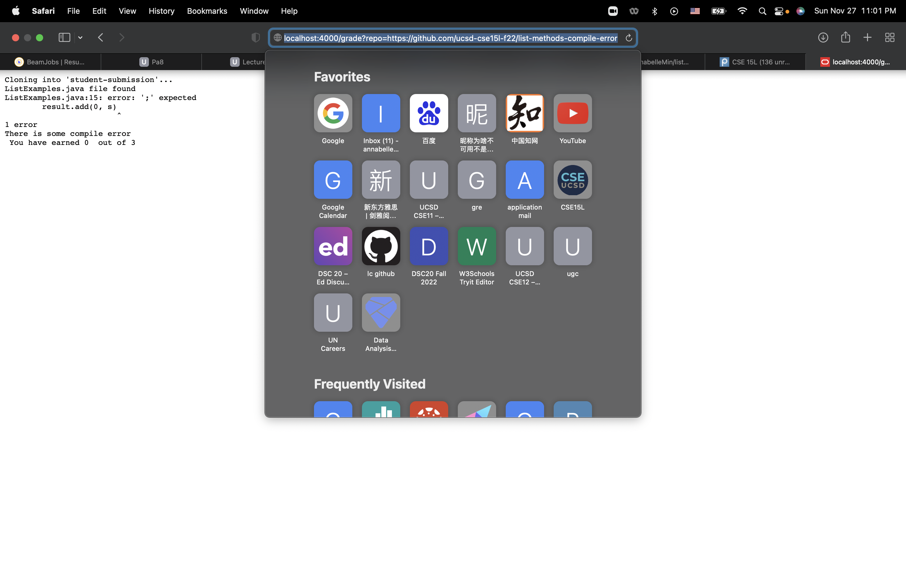
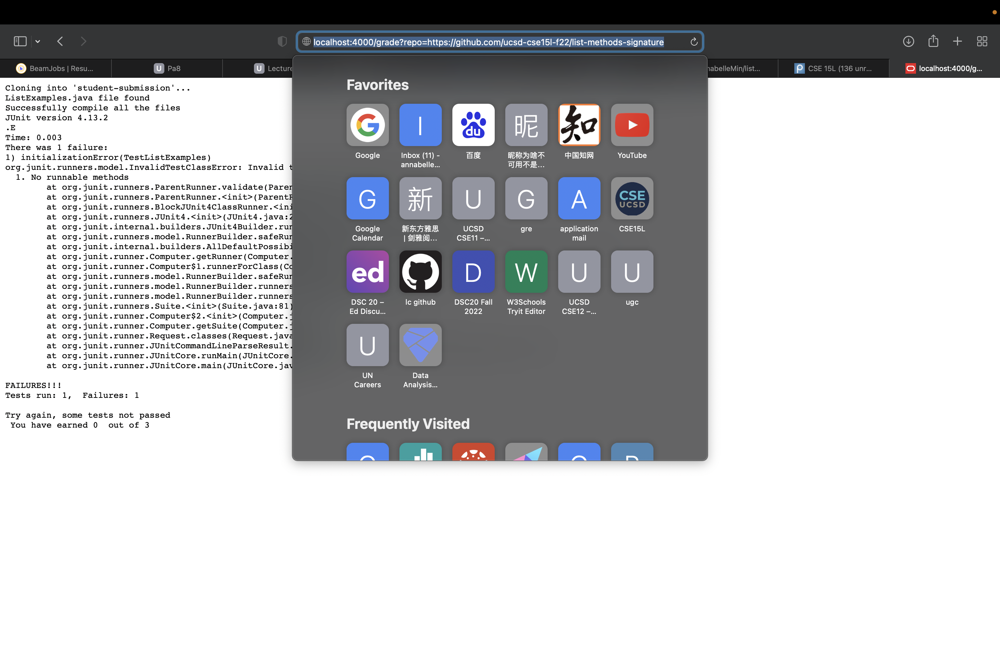

Hi! This is lab report 5, we will explore grading script this time.
>Part 1 the grade.sh code


```
# Create your grading script here

# set -e

rm -rf student-submission
git clone $1 student-submission
GRADE=0

# check if ListExamples.java exists
cd student-submission
if [ -f ListExamples.java ]
then
    echo "ListExamples.java file found"
else
    echo "ListExamples.java file not found"
    echo " You have earned "$GRADE " out of 3"
    exit 1
fi

cd ..
cp -r lib student-submission/
cp TestListExamples.java student-submission/
cd student-submission
javac -cp .:lib/hamcrest-core-1.3.jar:lib/junit-4.13.2.jar *.java

# check that the compile went fine
if [ $? -eq 00 ]
then
    echo "Successfully compile all the files"
else
    echo "There is some compile error"
    echo " You have earned "$GRADE " out of 3"
    exit 1
fi

java -cp .:lib/hamcrest-core-1.3.jar:lib/junit-4.13.2.jar org.junit.runner.JUnitCore TestListExamples

if [ $? -eq 00 ]
then
    GRADE=3
    echo "Cong! You passed all tests!"
    echo " You have earned "$GRADE " out of 3"
else
    echo "Try again, some tests not passed"
    echo " You have earned "$GRADE " out of 3"
fi
```
>Part2 3 submissions loaded on the browser





This is the end of Lab report 5. Thank you for reading.
