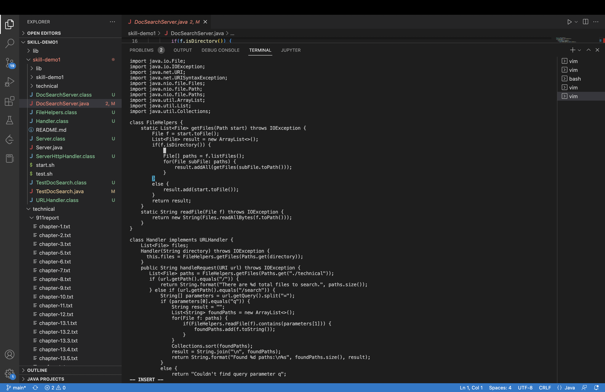
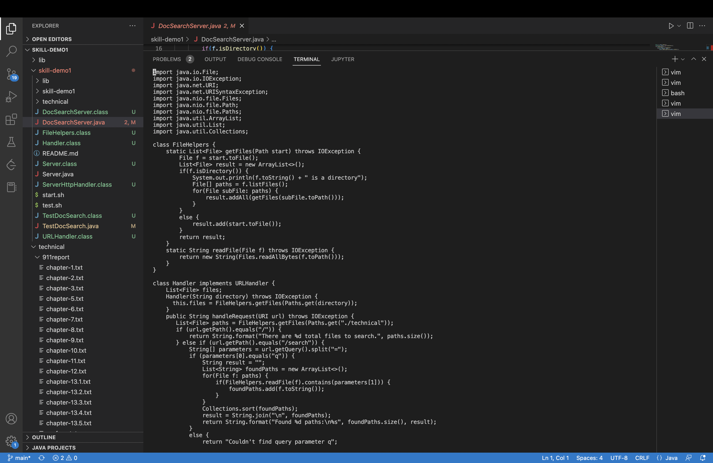
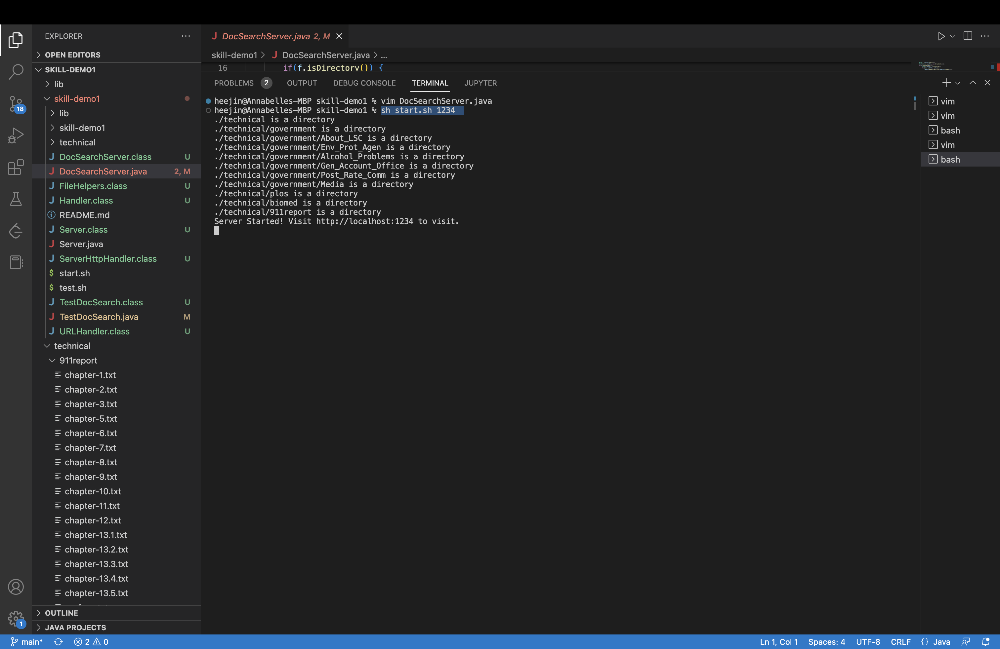

Hi! This is lab report 4, we will explore vim this time.

I am choosing to use the least vim lines to finish this task: Adding a new line to print before File[] paths = f.listfiles()

1) Open terminal and type 
```
vim DocSearchServer.java <return>
```
This pull of the file that we want to change in the vim mode


2) <Shift> a
This command change the vim mode from normal mode to insert mode 

	
3) press downward arraws 15 times and <Return> <Tab> <Empty Space>
This command change the cursor to the line that we want to add stuff by return
The Tab and Empty Space is just for indenting the cursor to where we want to insert lines.

	
4) System.out.println(f.toString() + " is a directory");
Type the above line on the screen

	
5) <ESC> :x 
This exit the vim mode

	
6) sh start.sh 1234
This is on the command line. and we can see the file to run.

