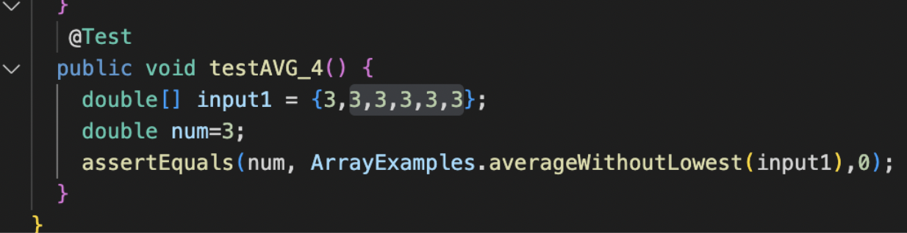
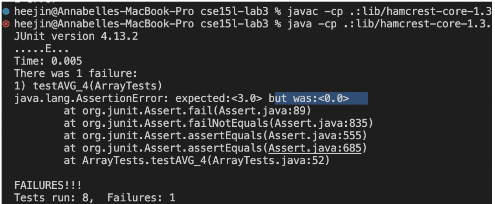
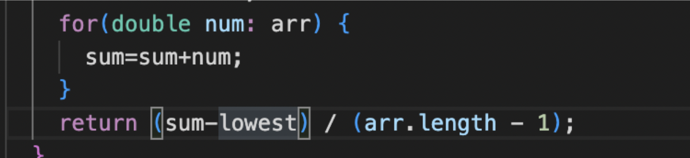
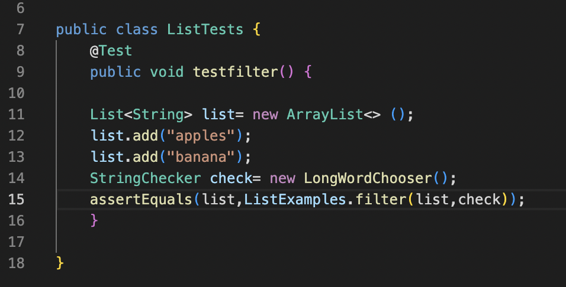

## Lab 2 Report
> Part 2

First, we are going to fix the Avgwithoutlowest method. By writing some tests on JUnit, I figure out the failure inducing input.

The inducing input is a list of 3s.
The symptom is as following:

The expectation value is 3 because (3+3+3+3+3)/5=3. However,the actual output returns 0. What happened?
It seems that in the original code, when we loop through the input array, the least number is not included in our calculation.
therefore, in this case, the least number is 3. Every time 3 appears in the input list, then it will not be included in the calculation.
So the the total=0, avg=0. Instead of 3.

Now, how to fix the code? We just simply try to modify the loop by adding all the numbers together and minus the least number once.
Appear as belowed images:

Second, we are going to fix the filter method in Listexamples. What does it suppose to do? It supposes to take a string list and return as a filtered string list.

The inducing input is a string list of <"apple" , "banana">

The failure output is:

## Lab 2 Report
> Part 2

First, we are going to fix the Avgwithoutlowest method. By writing some tests on JUnit, I figure out the failure inducing input.

The inducing input is a list of 3s.
The symptom is as following:

The expectation value is 3 because (3+3+3+3+3)/5=3. However,the actual output returns 0. What happened?
It seems that in the original code, when we loop through the input array, the least number is not included in our calculation.
therefore, in this case, the least number is 3. Every time 3 appears in the input list, then it will not be included in the calculation.
So the the total=0, avg=0. Instead of 3.

Now, how to fix the code? We just simply try to modify the loop by adding all the numbers together and minus the least number once.
Appear as belowed images:

Second, we are going to fix the filter method in Listexamples. What does it suppose to do? It supposes to take a string list and return as a filtered string list.

The inducing input is a string list of <"apple" , "banana">

The failure output is:

What is wrong? The expected result suppose to be <"apple" , "banana"> since the filter filter out string length >= 5. But it pringout somethin that is not directly understandable.

I did the following changes to fix the bug.

