Test for lab0:
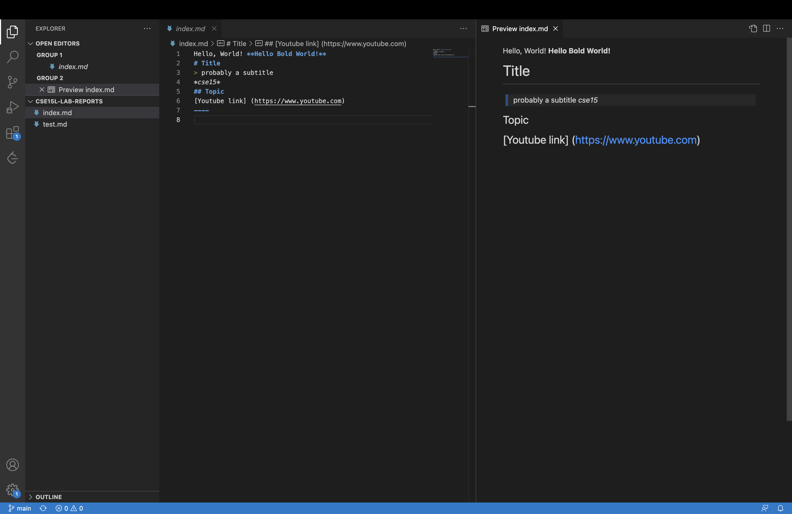
----
## Lab 1 Report
> Part 1: Install VSCode

Hello! This is the first lab report about getting the remote access. For starting that, you should download VScode on your desktop. [Click here for VScode download](https://www.youtube.com). You should see the webpage as the screenshot below. 

Then, select the system your laptop is (IOS/ Windows).

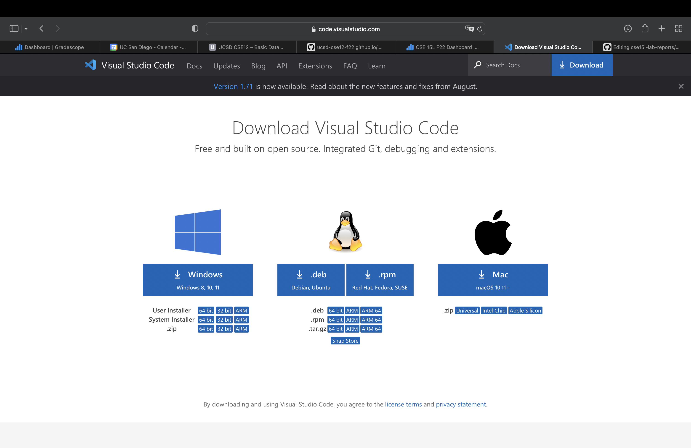

With all that installed, you should see the VScode page as below. The detailed installation part is skipped since I actually downloaded this few months ago and don't have to download the VScode again.

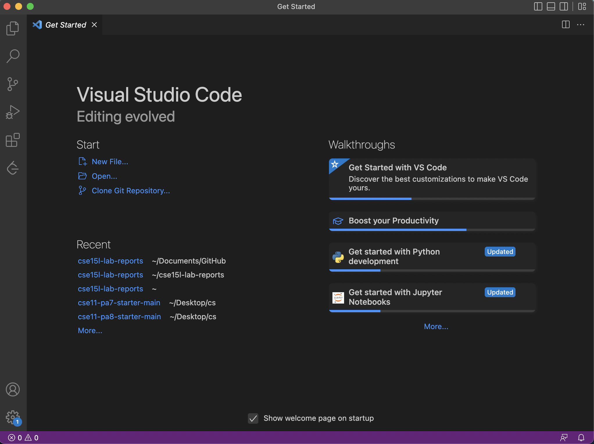

> Part 2: Remotely connecting

Open the VS code and the terminal, then type in % **ssh cs15lfa22dx@ieng6.ucsd.edu** (Don't include % in your input) And the "dx" part should be change into your own account number that is set for this course.

Then, you will be requested to enter your password to login. Type the password in the terminal. It is totally normal that the password does not show up in the screen. If you enter the password correctly, yayyy, you are in!

The successful remote control page should be very similar to the following screenshot.

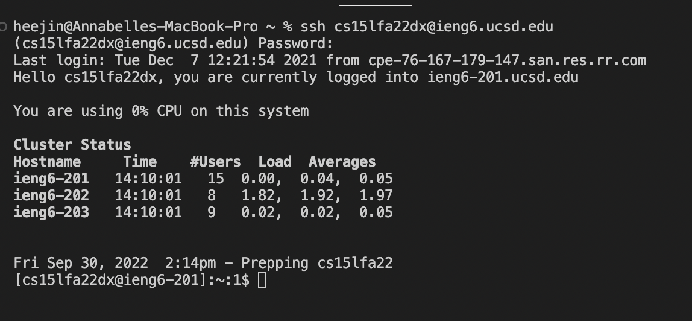

> Part 3: Trying some commands

Now, let's try running commands on both remote and local server to see how the result would be different!

Type **ls -lat** in your terminal on your remote server. You should see something similar to this:

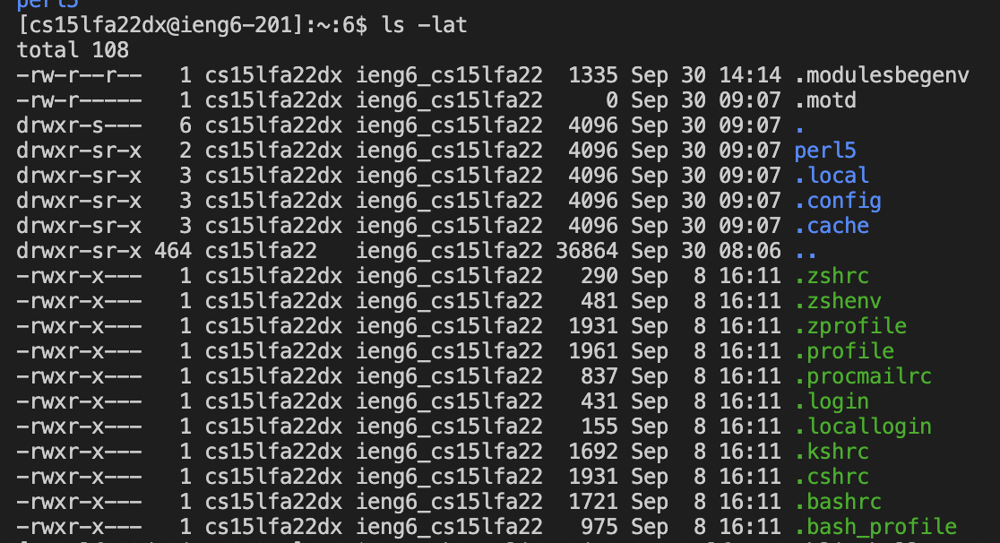

Then, type exit in the terminal to logout from the remote control and back to your local desktop. Type **ls -lat** again to see what happens.

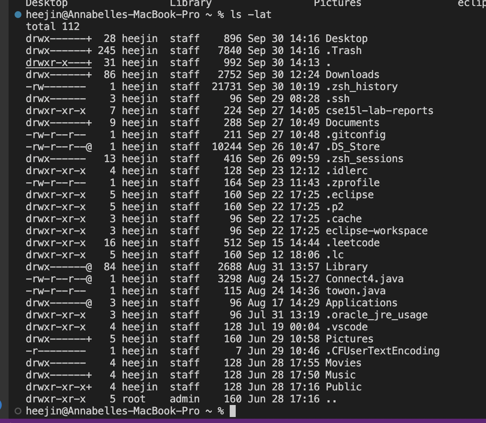

See, the same command in remote server and your server return different contents. **ls -lat** would give you all the files, shown in long format, sort by time already. So, you can see the different files you get from remote and your computer.

> Part 4: Moving Files with scp

Now, we are going to make a new file on our computer and copy it to the remote server. We should start with create a new file on our laptop by finding 'File' botton on left-top corner and then name the file as WhereAmI.java. Then we paste the java file content that is provided by the instruction (or in the future, the file you want to copy) in to the file.

On terminal, type :
javac WhereAmI.java (This one is for compiling the file)
java WhereAmI

The terminal should return ('os.name','user.name','user.file','user.dir') respectively.

Up to now, you successfully create a new java file on your laptop and make it run. Yayyyy! We are going to move this file with scp.

Type % scp WhereAmI.java cs15lfa22dx@ieng6.ucsd.edu:~/ in to the terminal to move the file (dx should be replaced by your own accountid)
It will ask you for a password, just type it in and return

Now the whereAmI.java is in remote server. Try to login to the remote server by ieng and then check if the file exists.

The overall steps should be similar to this:

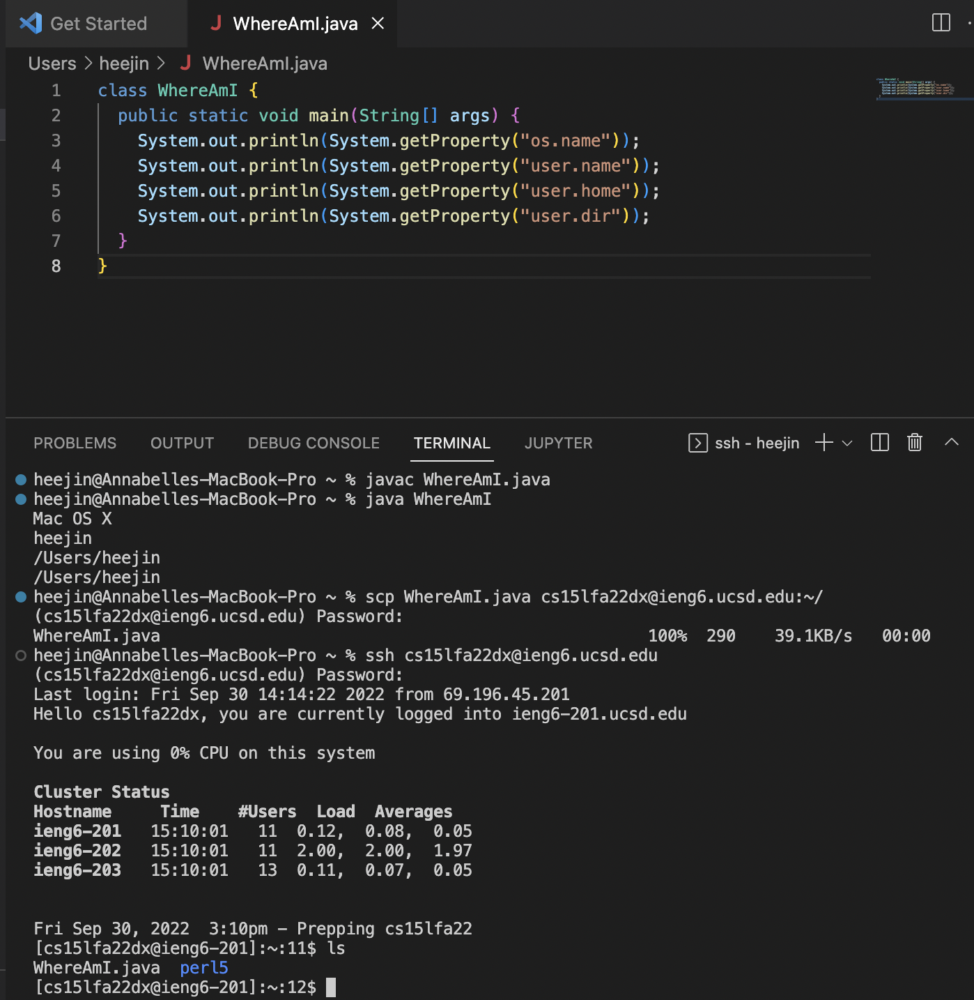

On the last few lines on the screenshot, you can see **WhereAmI.java  perl5** This indicates that WhereAmI.java is in the remote server. Yayy!

> Part 5: Setting an SSH key

It is super inconvinient to type in your password for remote control everytime. Let's see what shall we do to go over such repetition.

First, type **ssh-keygen** in your computer and keep pressing enter to set the default path for files.

It should be look like this:

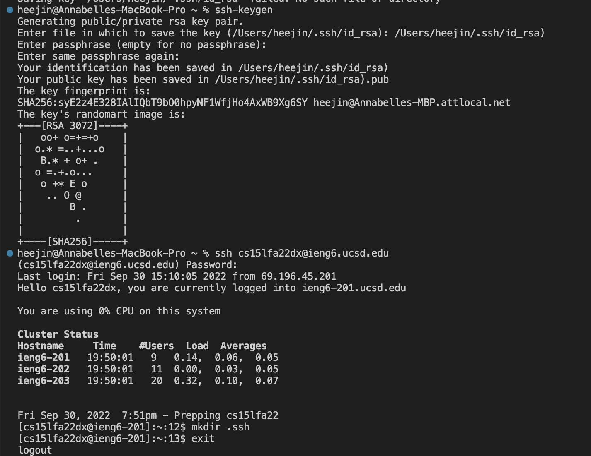

Then type **ssh cs15lfa22zz@ieng6.ucsd.edu** (zz should be replaced with your account)

This will let you type in the password.

On the remote server, type **mkdir .ssh** It is okay that it shows wierd message

Just exit from the remote server and use SCP to copy the password.

Now, type **scp /Users/heejin/.ssh/id_rsa.pub cs15lfa22dx@ieng6.ucsd.edu:~/.ssh/authorized_keys** (heejin should be replaced to your desktop name and dx should be replaced to your account)

This will lead you to type in the password, don't panic!

Once you type the password, the terminal will show:
**id_rsa.pub                                                                                                         100%  588    18.1KB/s   00:00 **

this means you are ready to go! Now let us have some fun.

First, let us run WhereAmI.java on our computer

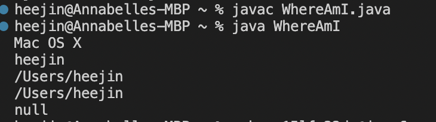

Then, we try to log in th the remote server by using ssh. See, this time the terminal doesn't ask you for your password. Save us so more time!

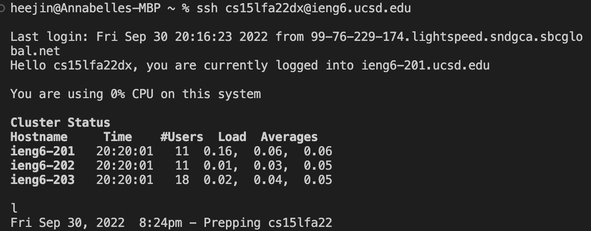

Then we try to run WhereAmI.java on remote server. It works!

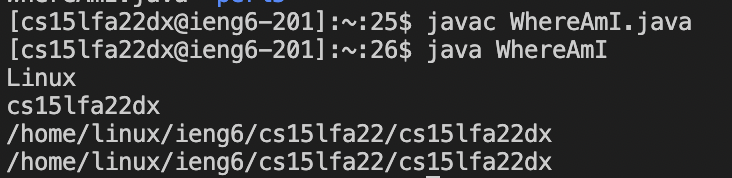

> Part 6: Optimizing Remote Running

There are some small tricks to make our lives easier. 

## If you want to have multiple command in the same terminal, you can write in same line, just to have ; between each of them

# #If you want to directly go from login to remote server to make some command over there, you can also type the command with "" around it

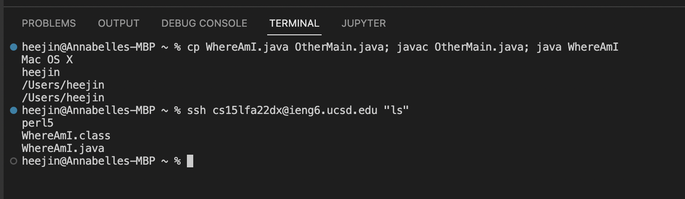

Cong! You have just finished lab 1!
