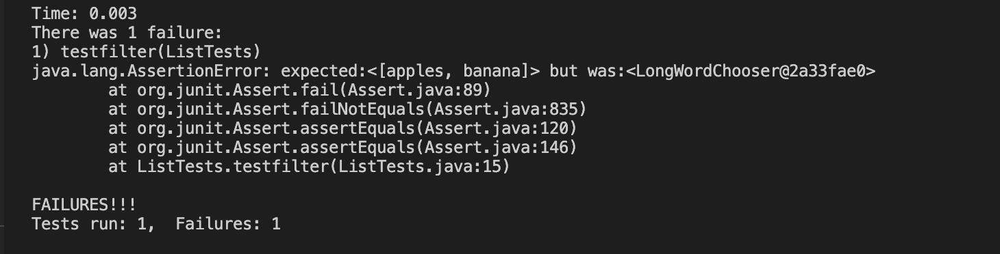

 ## Lab Report 2
 > Part 1
 First, the code for simplest Search Engine is as below: This is the same as the NumberServer.java but replace the num to String.
   
    import java.io.IOException;
    import java.net.URI;
    import java.util.*;

    class Handler implements URLHandler {
    List<String> outputList = new ArrayList<String>();
    
    public String handleRequest(URI url) {
        if (url.getPath().contains("/")) {
            if (url.getPath().contains("add")) {
                String[] parameters = url.getQuery().split("=");
                if (parameters[0].contains("s")) {
                    if (parameters[1].contains("anewstringtoadd")) {
                        outputList = new ArrayList<String>();
                        return String.format("%s", outputList);
                    } else {
                        outputList.add(parameters[1]);
                        return String.format("%s", outputList);
                    }
                } else {
                    return "404 Not Found!";
                }
            } else if (url.getPath().contains("search")) {
                String[] parameters = url.getQuery().split("=");
                List<String> found = new ArrayList<String>();

                if (parameters[0].contains("s")) {

                    for (String str : strList) {
                        if (str.contains(parameters[1])) {
                            found.add(str);
                        }
                    }
                }
                return String.format("%s", found);

            } else {
                return String.format("%s", strList);
            }
        }
        return "404 Not Found!";
    }
    }

    class NumberServer {
    public static void main(String[] args) throws IOException {
        if(args.length == 0){
            System.out.println("Missing port number! Try any number between 1024 to 49151");
            return;
        }

        int port = Integer.parseInt(args[0]);

        Server.start(port, new Handler());
    }
    }

> Part 2

First, we are going to fix the Avgwithoutlowest method. By writing some tests on JUnit, I figure out the failure inducing input.

The inducing input is a list of 3s.
The symptom is as following:

The expectation value is 3 because (3+3+3+3+3)/5=3. However,the actual output returns 0. What happened?
It seems that in the original code, when we loop through the input array, the least number is not included in our calculation.
therefore, in this case, the least number is 3. Every time 3 appears in the input list, then it will not be included in the calculation.
So the the total=0, avg=0. Instead of 3.

Now, how to fix the code? We just simply try to modify the loop by adding all the numbers together and minus the least number once.
Appear as belowed images:

Second, we are going to fix the filter method in Listexamples. What does it suppose to do? It supposes to take a string list and return as a filtered string list.

The inducing input is a string list of <"apple" , "banana">

The failure output is:

What is wrong? The expected result suppose to be <"apple" , "banana"> since the filter filter out string length >= 5. But it pringout somethin that is not directly understandable.

I did the following changes to fix the bug.

I figured out the bug by just reading through the lines and the bug is actually .add(0,s). This actually filtered out the string list in a reversed way since it is adding each input eleement in reverse order to the output list. I change that to .add(s) so that the s in input list can be append to the end of the output list instead of putting in the front.

This way the output list will be in the same order as the input list.
